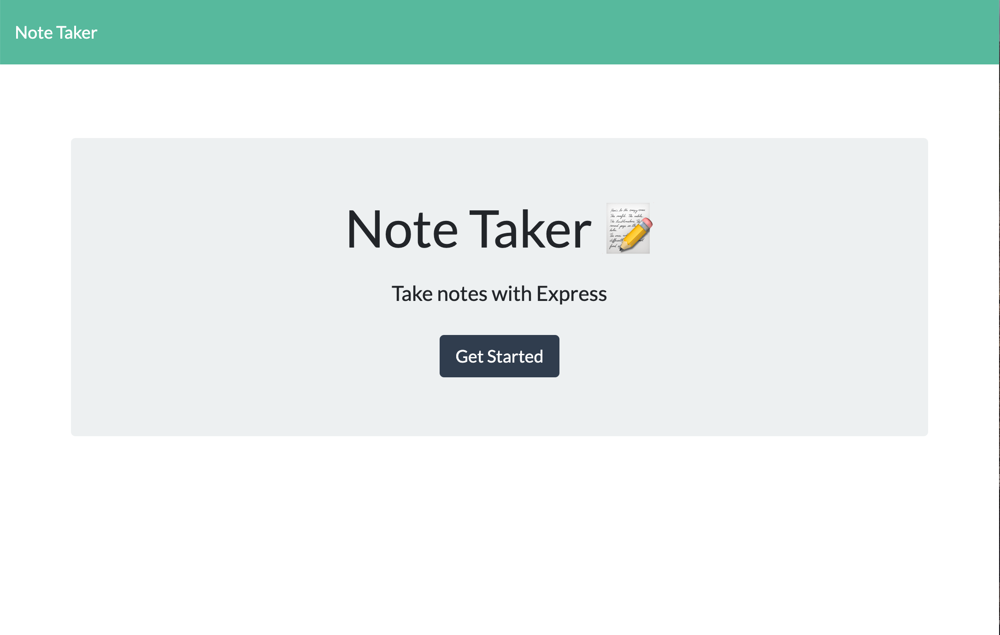
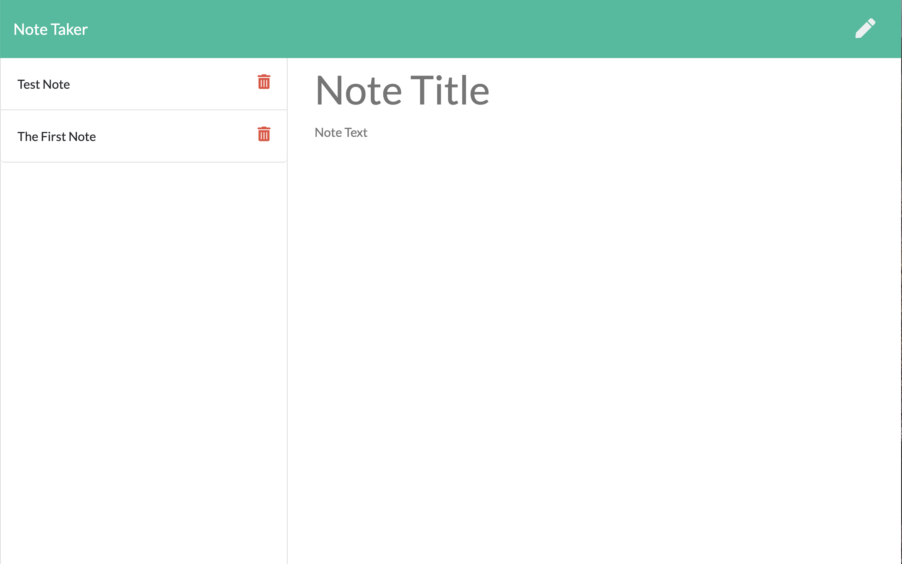

# Note Taker

  ## Description

  This project's objective is to create a Note Taker application that can write, save, and delete notes. The Note Taker application uses an express backend to save and retrieve note data from a JSON file.

  **Deployed Link:** https://sleepy-hamlet-86896.herokuapp.com/
  
  ## Application Preview
  
  

  ## Table of Contents
  1. [Installation](#Installation)
  2. [Usage](#Usage)
  3. [License](#License)
  4. [Contributing](#Contributing)
  5. [Tests](#Tests)
  6. [Questions](#Questions)

  ## Installation

  No installations required.

  ## Usage

  The user clicks on the **Get Started** button on the main page, and they are redirected to the notes page. The user clicks on the pencil at the top right of the page to create a new note. After typing the note title and note text, the user clicks on the floppy disk that will show up next to the pencil to save the note. The user clicks on each note button to view the note. Clicking the trash can on the note button will delete the note. To redirect back to the main page, the user clicks on the **Note Taker** at the top left of the page. 

  ## License

  Other

  ## Contributing

  Everyone is welcome to contribute. Please see [Questions](#Questions) below for the contact information.

  ## Tests

  N/A

  ## Questions

  Please visit https://github.com/achueng to learn more about this project and the developer.
  
  If there are any question, issues, or concerns, please contact Agnes via email at [agneschueng2020@u.northwestern.edu](mailto:agneschueng2020@u.northwestern.edu).
